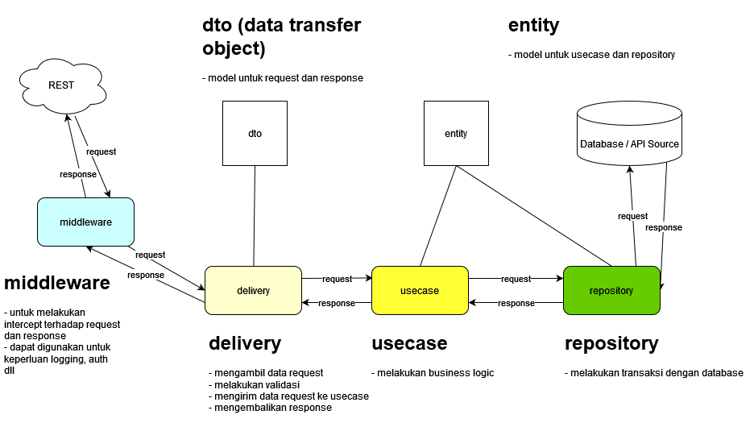

# ms-sv-jira

###### version: v0.5

###### Last Update: 2024-09-12

### Programming Language

- [go1.21 windows/amd64]

### Framework

- [GIN]

#### The diagram:



The explanation about this project's structure  can read from this medium's post : https://medium.com/@imantumorang/golang-clean-archithecture-efd6d7c43047

### How to Deploy on Localhost

```
go run .
```

### How to Test on Localhost or Development Server

```
go test bitbucket.org/ms-sv-jira/test/
```

### Environment Variables (Development)
Merupakan suatu variabel yang ditetapkan diluar program melalui fungsionalitas yang dibangun ke dalam OS atau Microservices. Tim DevOps perlu mengetahui Nama Env. Variables, Value Env. Variables, Description dari Env. Variables, dan Locationnya.

| Name                              | Description                                   |
|-----------------------------------|-----------------------------------------------|
| GIN_MODE                          | Gin Mode                                      |
| DB_SCHEMA                         | Database Schema                               |
| DB_DRIVER                         | Database Driver                               |
| DB_HOST                           | Database Host                                 |
| DB_PORT                           | Database Port                                 |
| DB_USER                           | Database User                                 |
| DB_PASSWORD                       | Database Password                             |
| DB_SSL_MODE                       | Database SSL Mode                             |
| SERVICE_HOST                      | Host Service                                  |
| SERVICE_PORT                      | Port Service                                  |
| JIRA_URL                          | Jira URL                                      |
| JIRA_EMAIL                        | Jira Email                                    |
| JIRA_TOKEN                        | Jira Token                                    |
| MINUTE_QUERY_FAIL                 | Minute Query Fail                             |